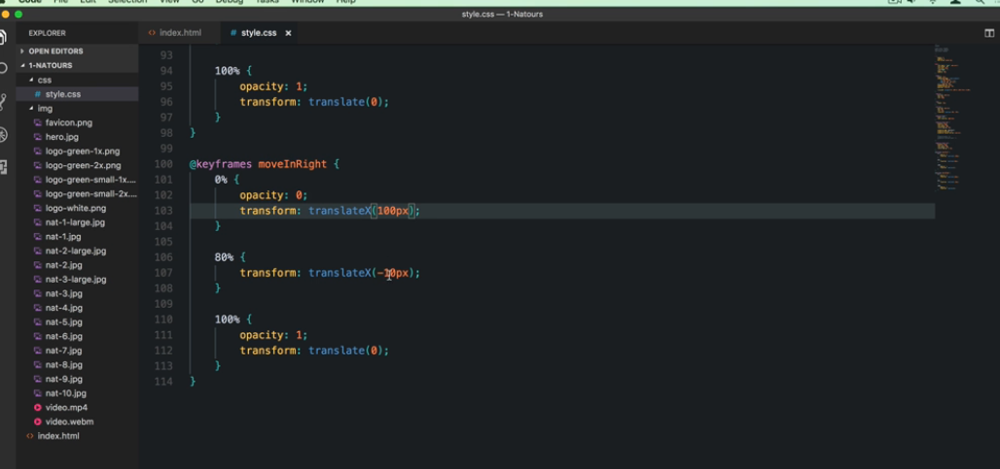
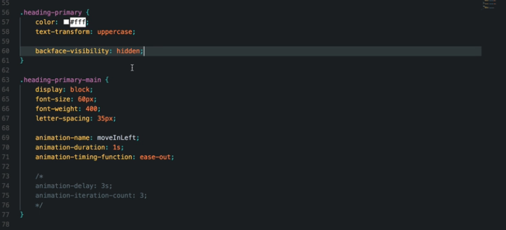
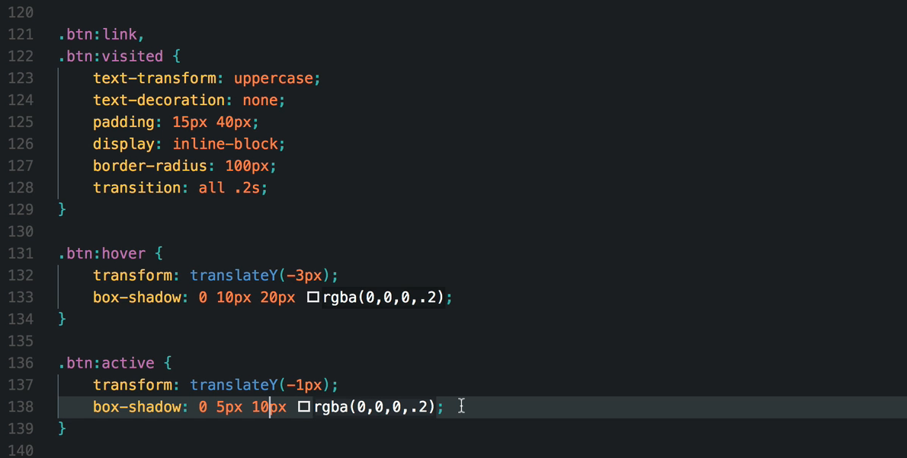
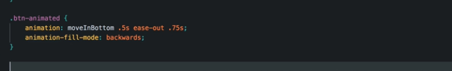

### Index :

- [Getting Started](#getting-started)

## Getting Started:

- keyframes
  
- Animation Properties
  
   

  > Note that the browsers are optimized to animate `opacity` and `transform` properties

 

- Transition

  

- Animation Fill mode will apply the properties of 0% keyframes to the beginning of the animation. It will make sense when we added a delay to the animation.
  
