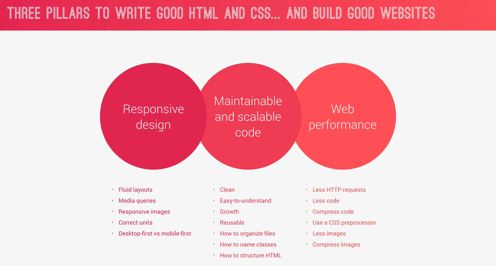
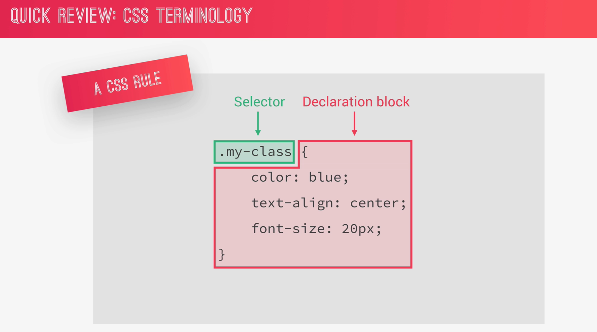
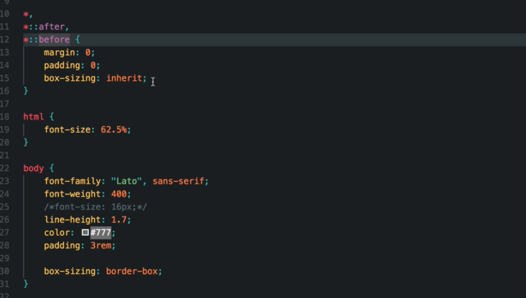
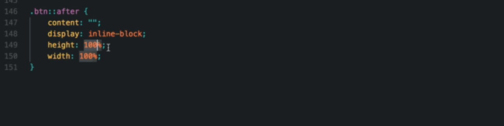
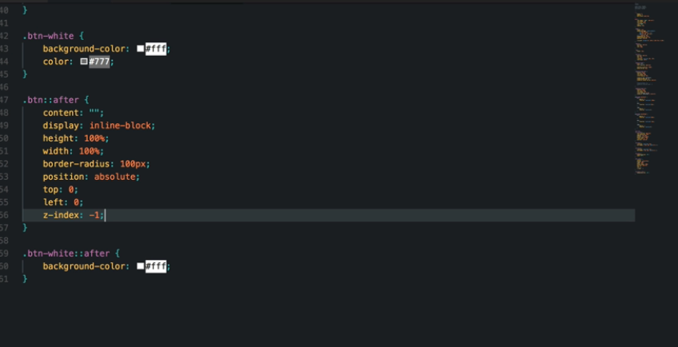

#Cascading Style Sheet

####Index

- [Universal Reset](#universal-reset)
- [Using ::after Pesudo Element](#using-after-pesudo-element)
- [Using `rem` from easy responsiveness](#using-rem-from-easy-responsiveness)

---




### Universal Reset

- `*` selects all the elements in the HTML

  ```css
  * {
    padding: 0;
    margin: 0;
    box-sizing: border-box;
  }
  ```

- Inorder to reset font, use `body` element selector, since all the font properties are inherited

  ```css
  body {
    font-family: sans-serif;
    font-weight: 400;
    font-size: 16px;
    line-height: 1.7;
    color: #777;
  }
  ```

  

  <br>

### Using ::after Pesudo Element

- we must provide the `content` and `display` property
  in order to work
  
- Since this element will be treated as a child to whichever element it is attached to, it can inherit their property.
  

  <br>

### Using `rem` from easy responsiveness

- By setting the root font size to `10px` we can use values which needs to be 100px as 10rem
- So when we code for responsiveness we only need to change only the root font size and all the order property which ises rem gets adopted to it
- Even more good practice is to set root font size to `62.5%` as the browser default root value is 16px, hence (10/16)\*100 = 62.5
- The Above step will make sure to use browser default so that if a user sets larger browser font, then, the design of our app gets adopted to it.
  <br>
