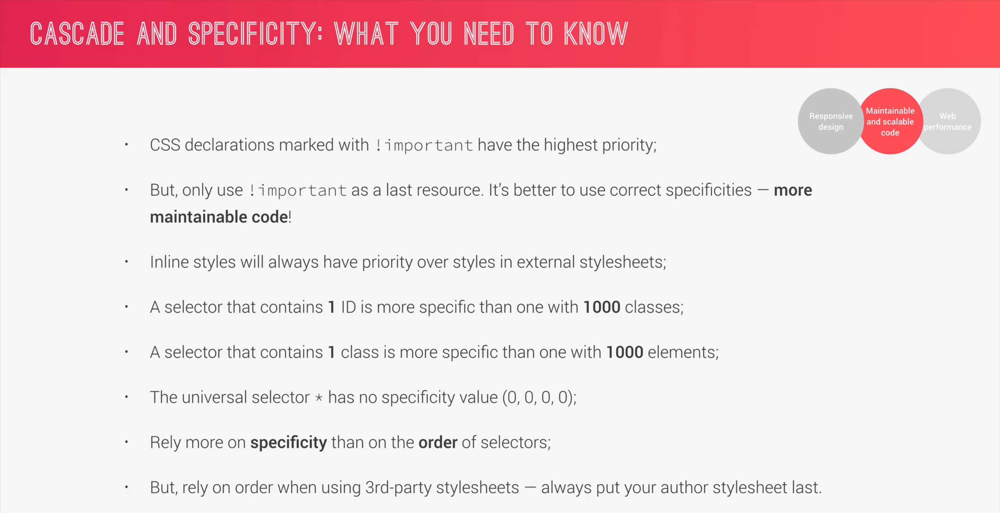

###Index

- [Cascading](#cascading)
- [Specificity](#specificity)
- [Processing and conversion of Values](#2-processing-values)
- [Inheritance](#inheritance)
- [How CSS renders a website](#how-css-renders-a-website)
  - [visual Formatting Modal](#visual-formatting-modal)
     

---

# How Css Works:

 

## 1. CSS Declaration:

### Cascading:

- This is the most important part of css

  
   

  
  
   

  

     

### Specificity:

- Here the hover won't work since it is given to less specific selector.
  
- In order the hover to work
  

 

## 2. Processing Value:

- Each value in css will be processed before it is appiled

  

- If There is no declared or browser default value, Each property in css will have a `initial value` which will be used.
  
  
   
- Conversion of values
  
  
  
  
  
  
   

- Summary
  

 

## Inheritance

# How CSS renders a website

## Visual Formatting Modal

### 1. Box Modal

- 
  
  

### 2. Box Type

- 

### 3. Positioning Scheme

- 

### 4. Stacking Context

- 
