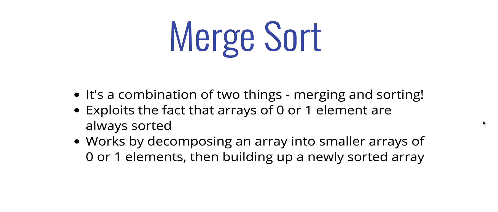
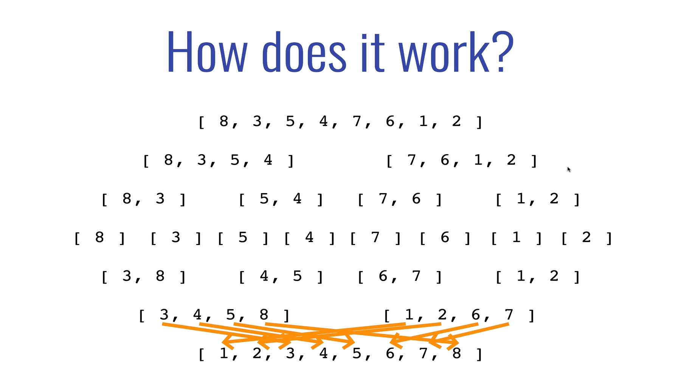
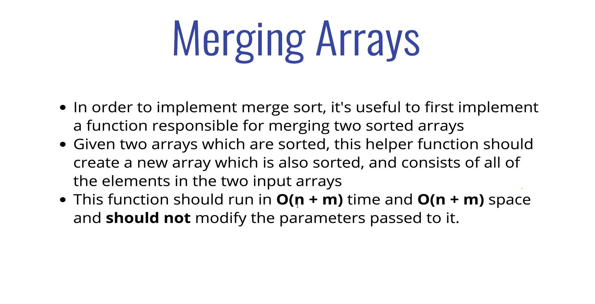
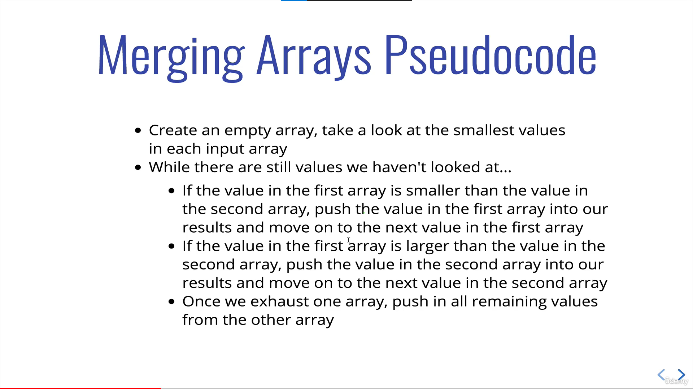
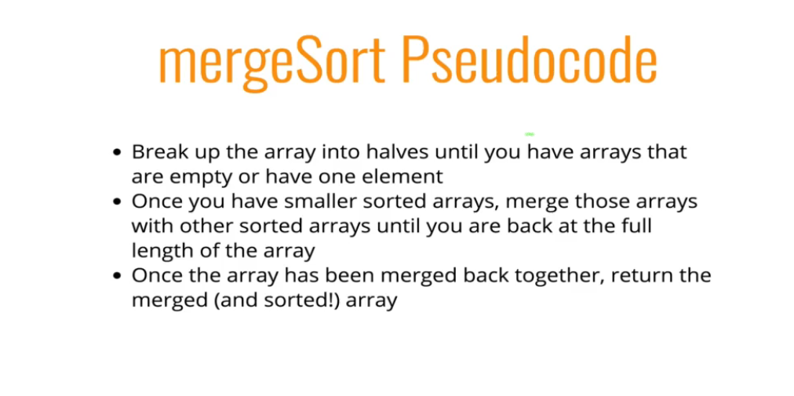
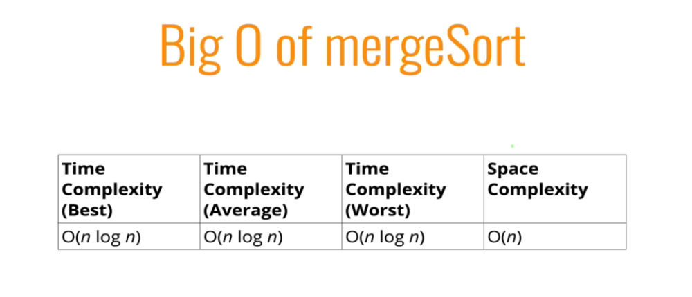
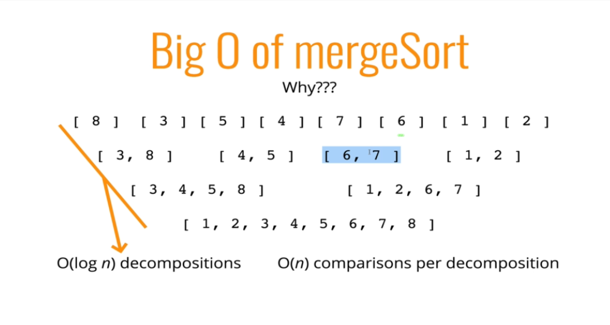
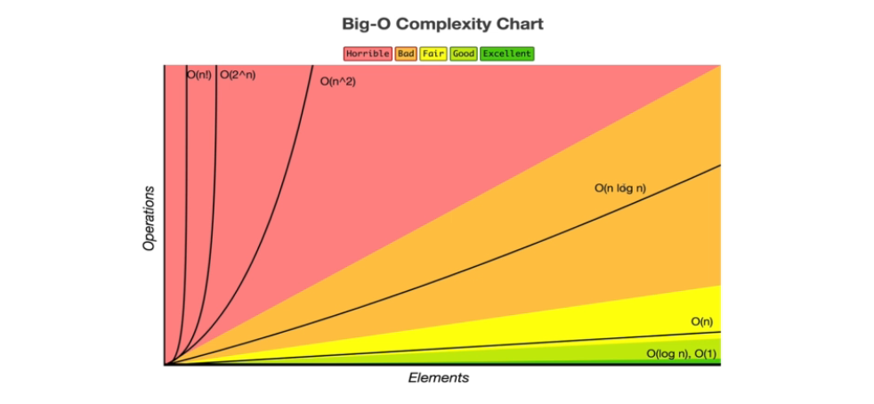

# Merge Sort





### Merging





```js
function merge(arr1, arr2) {
  let result = [];
  let i = 0;
  let j = 0;
  while (i < arr1.length && j < arr2.length) {
    if (arr1[i] < arr2[j]) {
      result.push(arr1[i]);
      i++;
    } else {
      result.push(arr2[j]);
      j++;
    }
  }
  // if (i === arr1.length)
  // result = [...result, ...arr2.slice(j)]
  // else
  // result = [...result, ...arr1.slice(i)]
  while (i < arr1.length) {
    result.push(arr1[i]);
    i++;
  }
  while (j < arr2.length) {
    result.push(arr2[j]);
    j++;
  }

  return result;
}
```

### Merging + Sorting



```js
function mergeSort(arr) {
  if (arr.length <= 1) return arr;
  let mid = Math.floor(arr.length / 2);
  let left = mergeSort(arr.slice(0, mid));
  let right = mergeSort(arr.slice(mid));
  return merge(left, right);
}
```

<br>

##### Big O



- spliting - O(log n)
- Comparison in Merging - O(n)
- Merge Sort - O(n log n)




