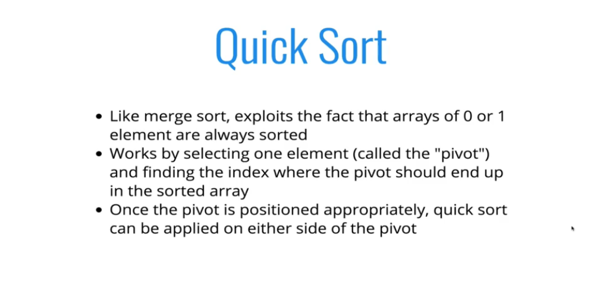
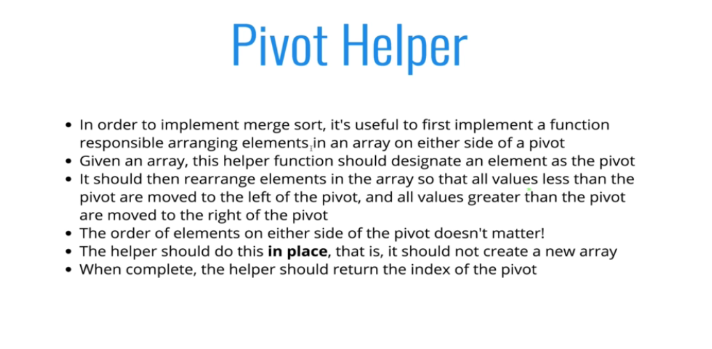
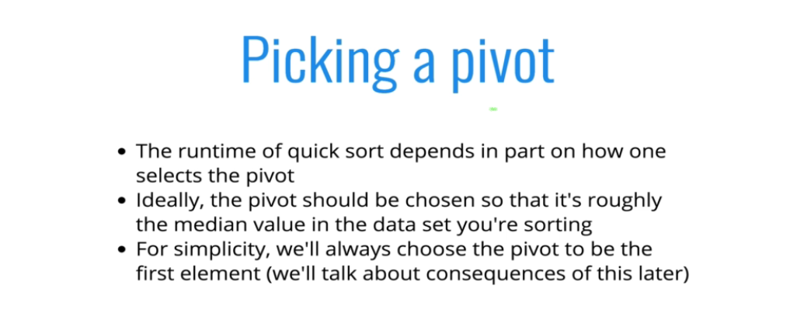
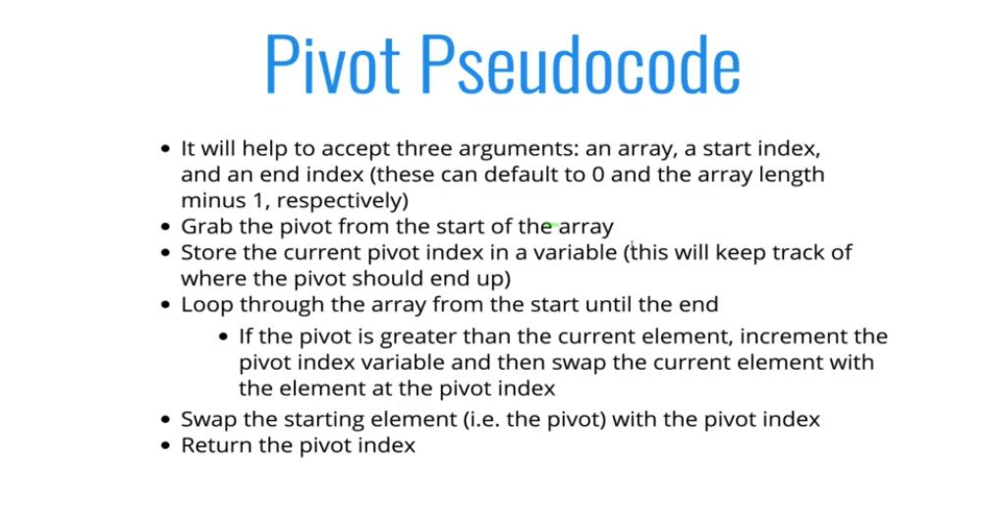
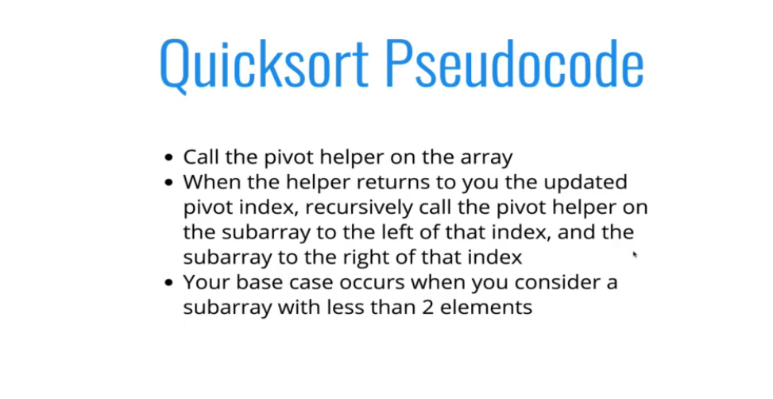
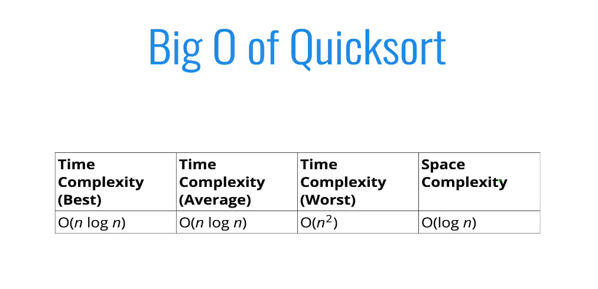
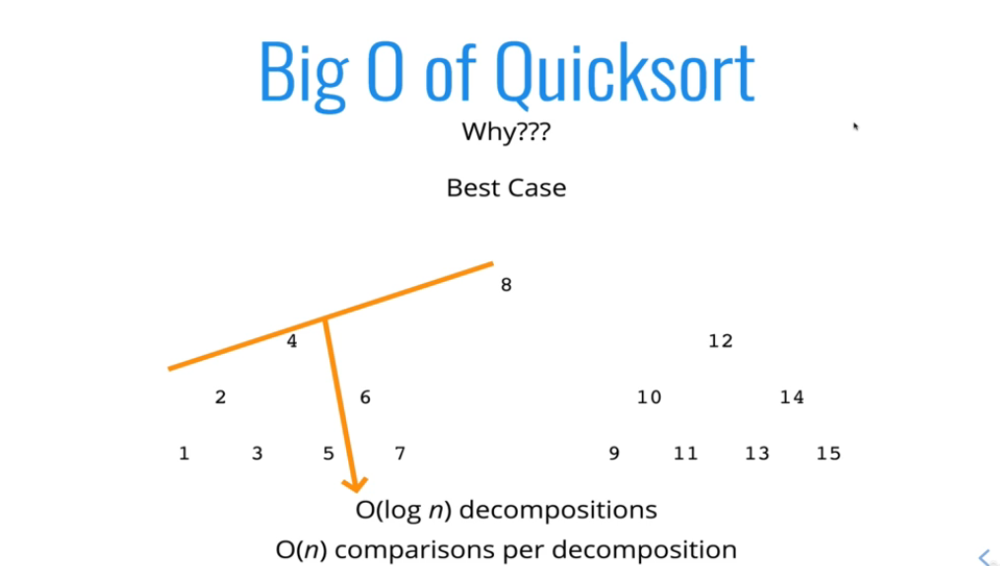
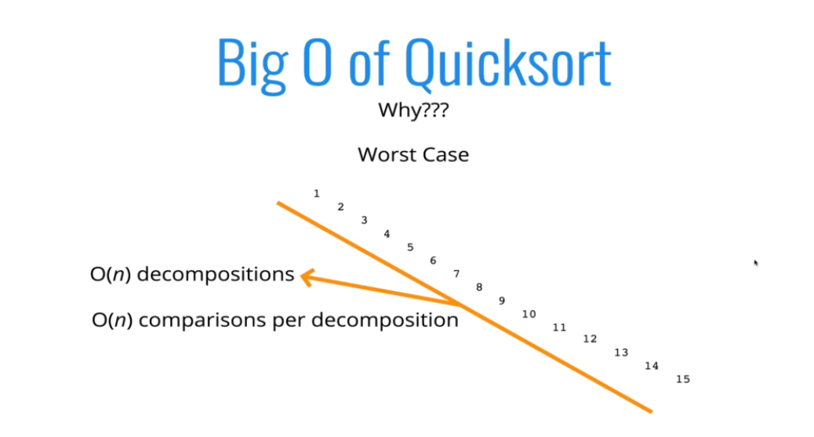

# Quick Sort



### Pivot / Partition helper






```js
function pivot(arr, start, end) {
  let swapIndex = start;
  let swap = (arr, idx1, idx2) => {
    [arr[idx1], arr[idx2]] = [arr[idx2], arr[idx1]];
  };

  for (let i = start + 1; i <= end; i++) {
    if (arr[i] < arr[start]) {
      swapIndex++;
      swap(arr, swapIndex, i);
    }
  }

  swap(arr, swapIndex, start);

  return swapIndex;
}
```

### Quick sort implelmentation



```js
function quickSort(arr, start = 0, end = arr.length - 1) {
  if (start < end) {
    let pivotIndex = pivot(arr, start, end);
    //left
    quickSort(arr, start, pivotIndex - 1);
    // right
    quickSort(arr, pivotIndex + 1, end);
  }
  return arr;
}
console.log(
  quickSort([92, 21, 12, 45, 3, 5, 0, -22, -44, -9, 2389]).toString()
);
```

#### Big O




- if the array is already sorted
  
  - In this case if we pick any random element in array instead of the first element, we can escape from O(n^2) time complexity.
    <br>
  - Hence picking the pivot determines the Big O
