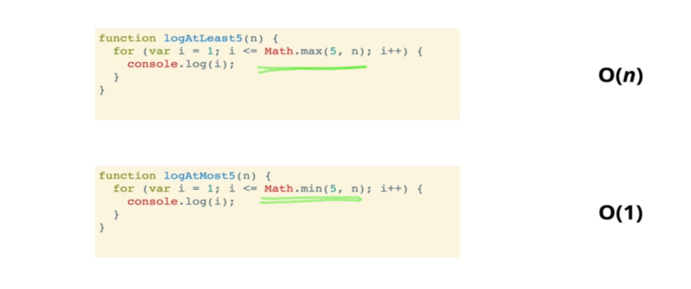
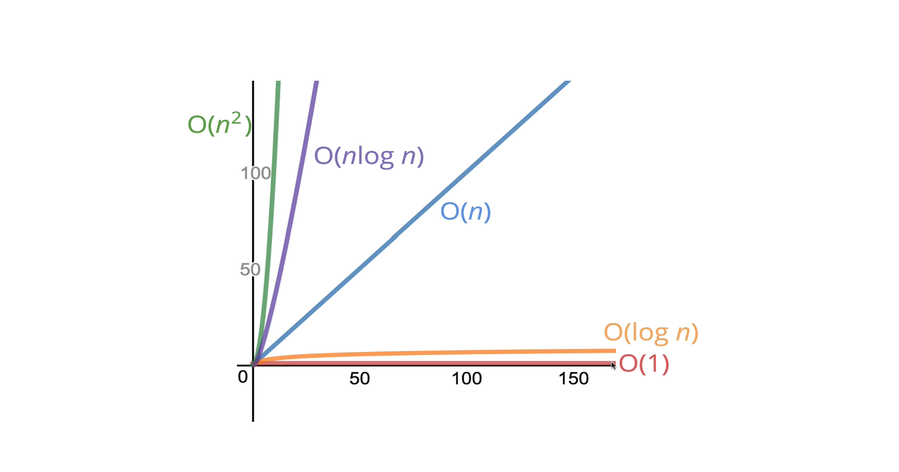
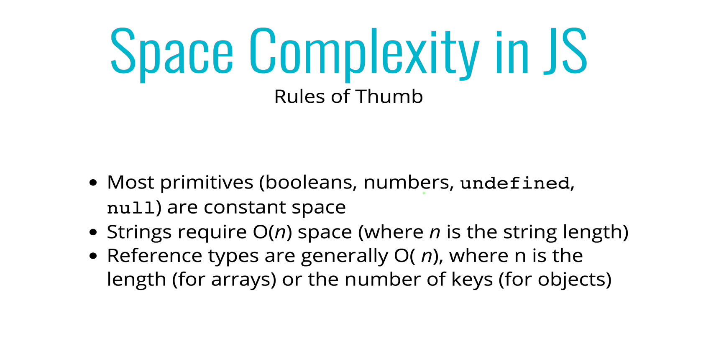
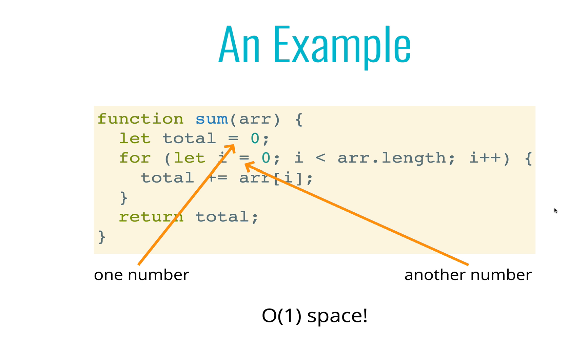
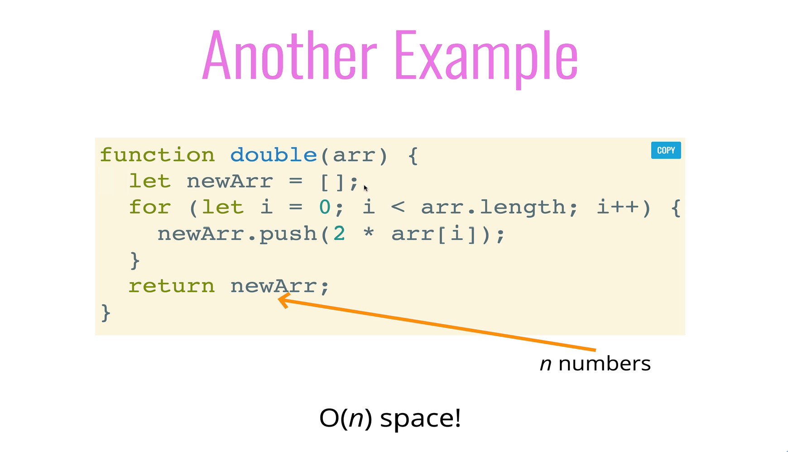
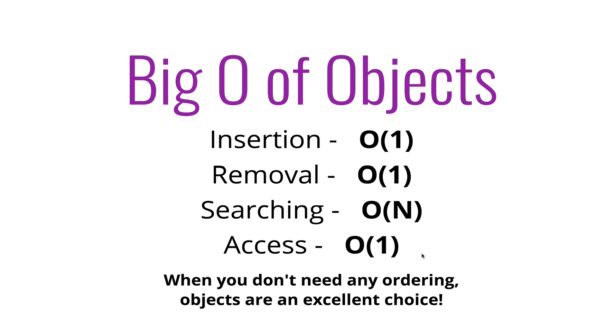
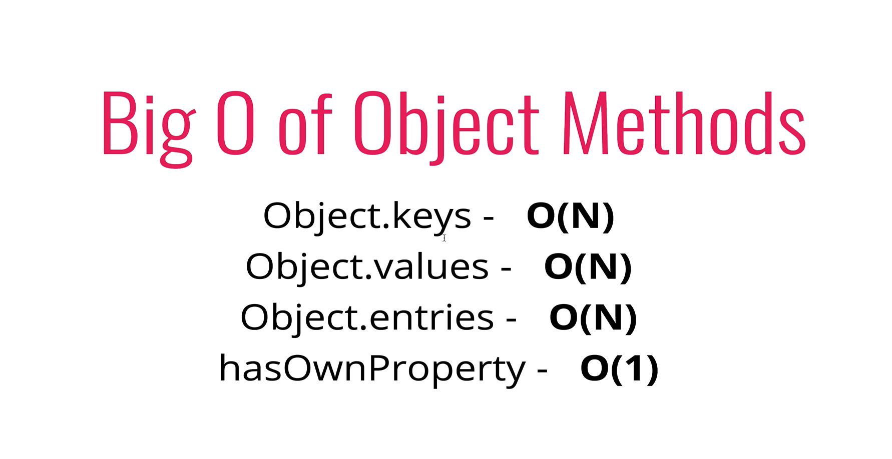
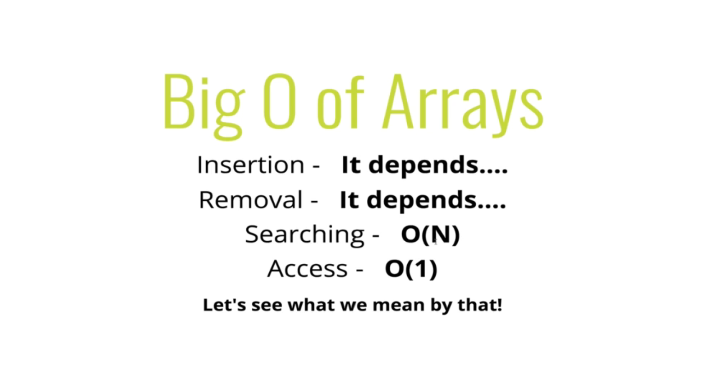
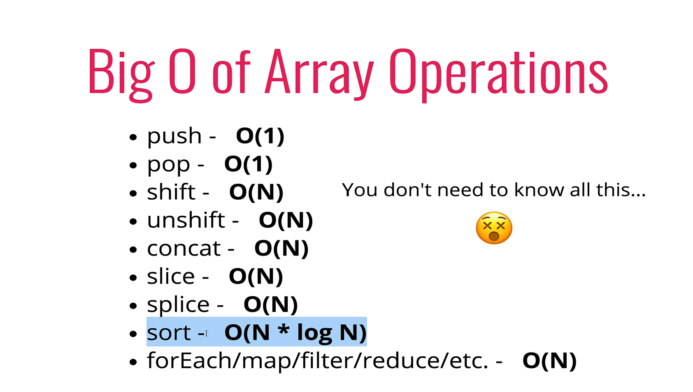

# Big O Notation

- To analyse the performace of an algorithm, we use Big O notation
- It allows us to talk about how time & space grows as input grows and gives us a high level understanding of time or space complexity of an algorithm
- They don't care about the precision, only general trends _(Linear, Quadratic, Constant)_
- Time and space complexity _(measured by big O)_ depends only on the algorithm, not on the hardware used to run the algorithm

  ### Time Complexity

  - When determining the time complexity of an algorithm, there are some rule of thumb for Big O Expressions.

  - `Constants don't matter`

    ```js
    //constant
    - O(500) => O(1)

    //Linear
    - O(2n) => O(n)
    - O(100n + 10) => O(n)

    // Quadratic
    - O(13n^2) => O(n^2)
    - O(n^2 + 5n + 10) => O(n^2)
    ```

  - `Arithmetic Operations are constants`
    <br>
  - `Variable Assignment is constant`
    <br>
  - `In loop, the complexity is the length of the loop time the complexity of whatever happens inside the loop`
    <br>
  - `Accessing Element in an array using index/key is constant`
    <br>

    Examples
    

    Time v Input
    

  ### Space Complexity

  - How much additional memory do we need to allocate to run the algorithm _(Space required by the algorithm, not including space taken up by the inputs - Also known as `Auxiliary space complexity`)_
    <br>
    
    <br>
    
    
    <br>

# Big O of Objects





# Big O of Array




