# Singly Linked List

### Introduction

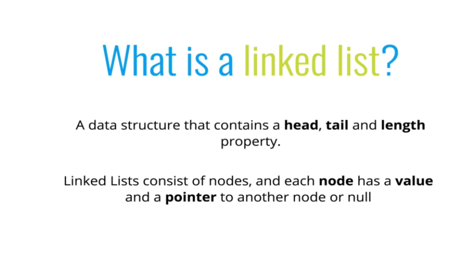
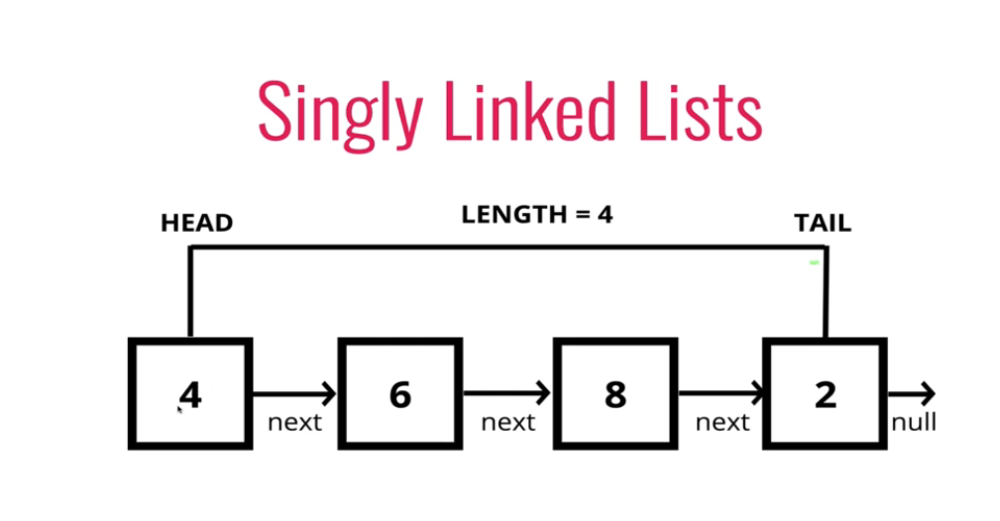

### Comparison

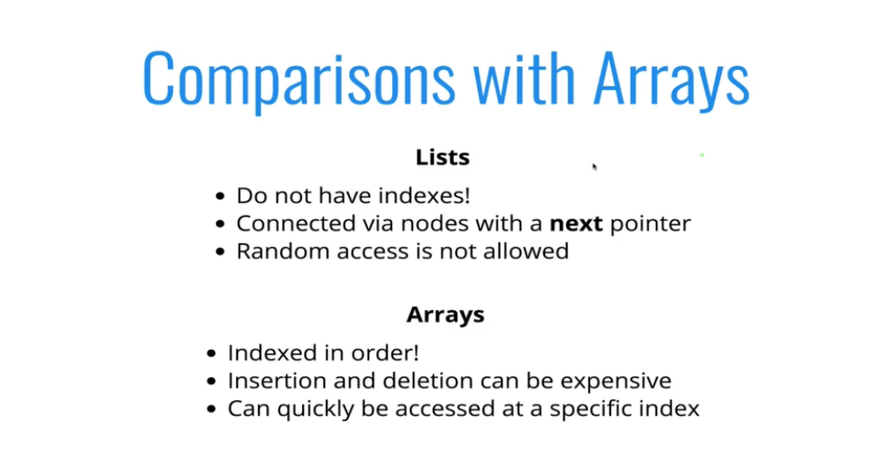

- Insertion and deletion is efficient in list as it takes very few steps

## Implementation:

```js
class Node {
  constructor(val) {
    this.val = val;
    this.next = null;
  }
}

class SinglyLinkedList {
  constructor() {
    this.head = null;
    this.tail = null;
    this.length = 0;
  }
}
let list = new SingleLinkedList();
```

#### 1. Push

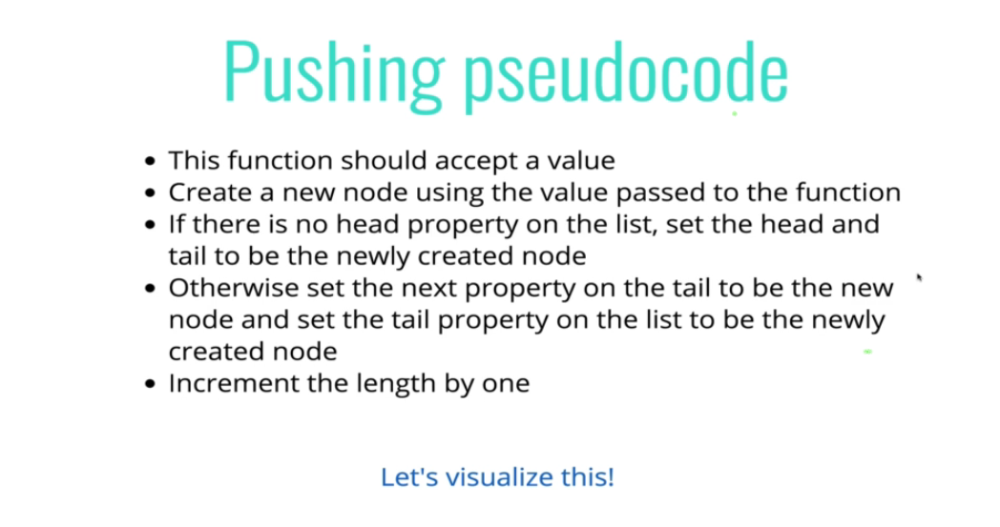

```js


  push(val) {
    let newNode = new Node(val);
    if (!this.head) {
      this.head = newNode;
      this.tail = newNode;
    } else {
      this.tail.next = newNode;
      this.tail = newNode;
    }
    this.length += 1;
  }

```

#### 2. Pop

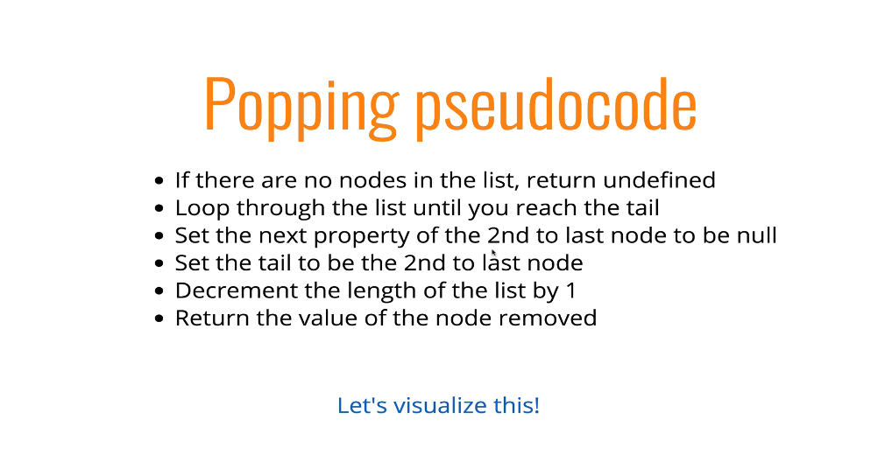

```js
pop() {
        if (!this.head) return;
        let current = this.head;
        let previous = current;
        while (current.next) {
            previous = current
            current = current.next;
        }
        previous.next = null;
        this.tail = previous
        this.length--
        if (!this.length) {
            this.head = null;
            this.tail = null;
        }
        return current
    }
```

#### 3. Shift

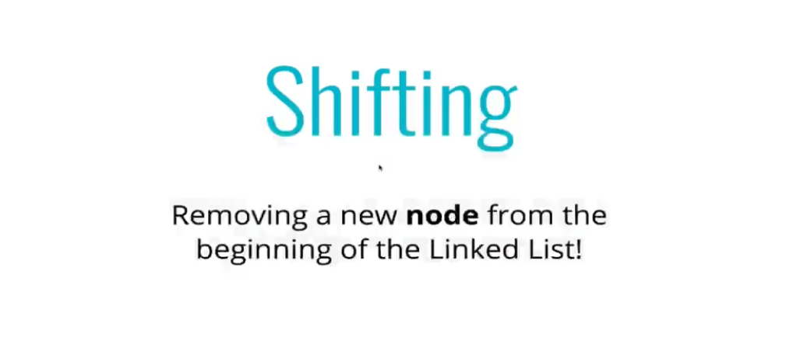
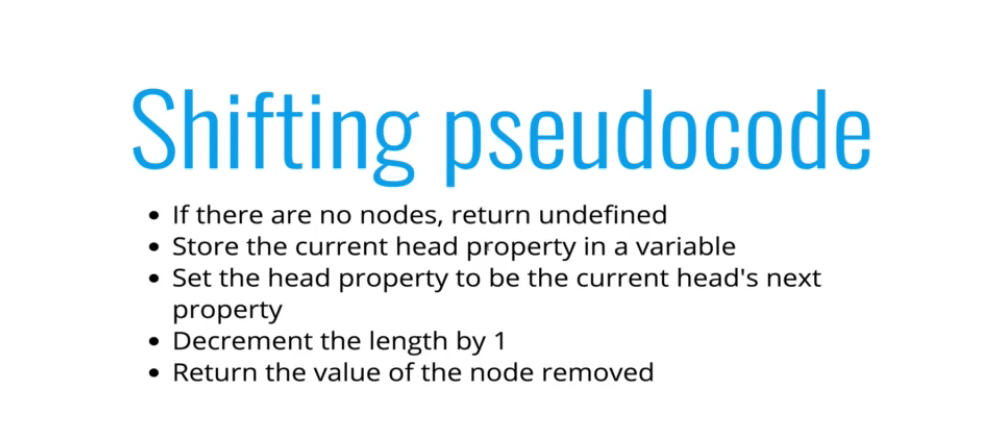

```js
shift() {
        if (!this.head) return;
        let current = this.head;
        this.head = current.next;
        this.length--;
        if (!this.length)
            this.tail = null
        return current
    }
```

#### 4. Unshift

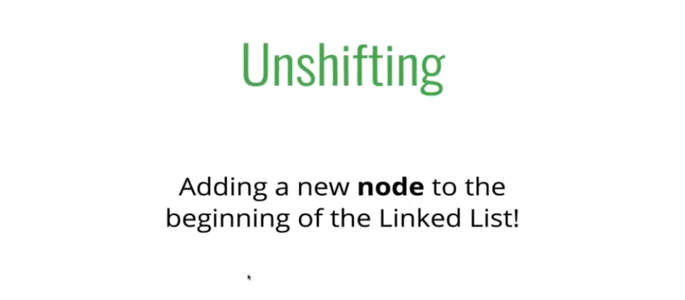
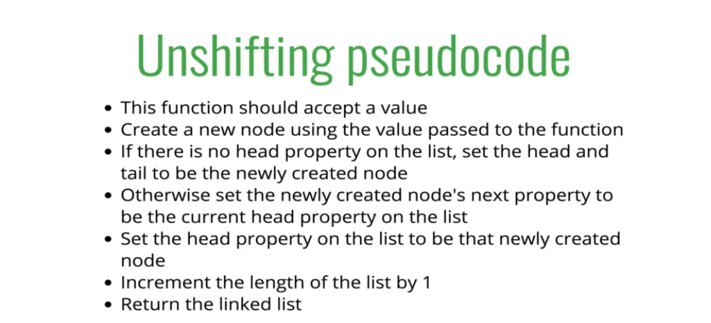

```js
unshift(val) {
        let newNode = new Node(val);
        if (!this.head) {
            this.head = newNode;
            this.tail = this.head;
        }
        else {
            newNode.next = this.head;
            this.head = newNode
        }
        this.length += 1
        return this
    }
```

#### 5. Get

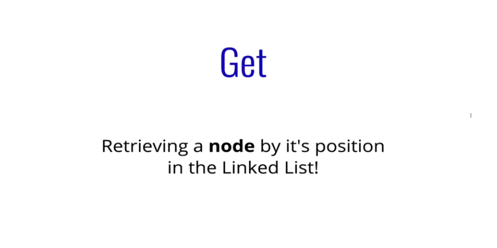
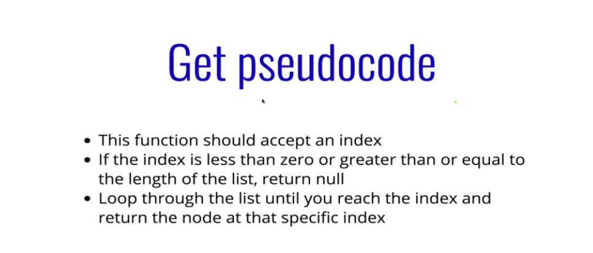

```js
 get(index) {
        if (index < 0 || index >= this.length)
            return null;
        let currentNode = this.head;
        let counter = 0;
        while (counter !== index) {
            currentNode = currentNode.next;
            counter++
        }
        return currentNode
    }
```

#### 6. Set

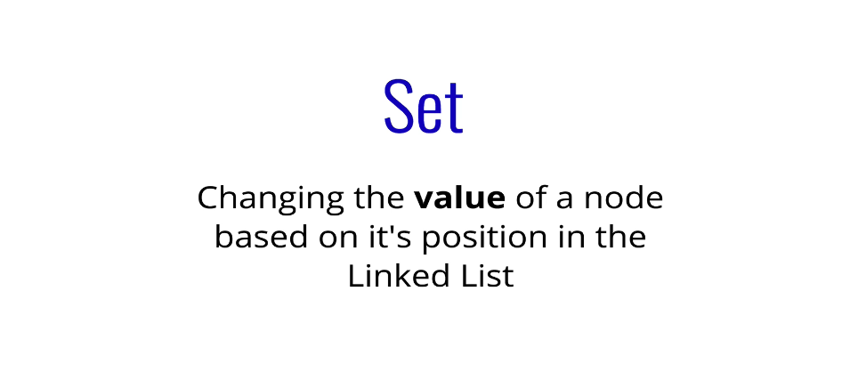
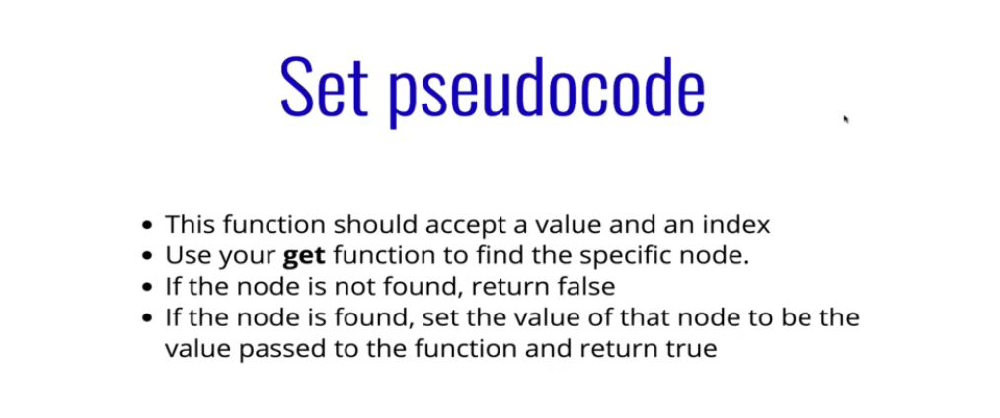

```js
set(index, value) {
        let currentNode = get(index);
        if (currentNode) {
            currentNode.value = value;
            return true;
        }
        return false;
    }
```

#### 7. Insert

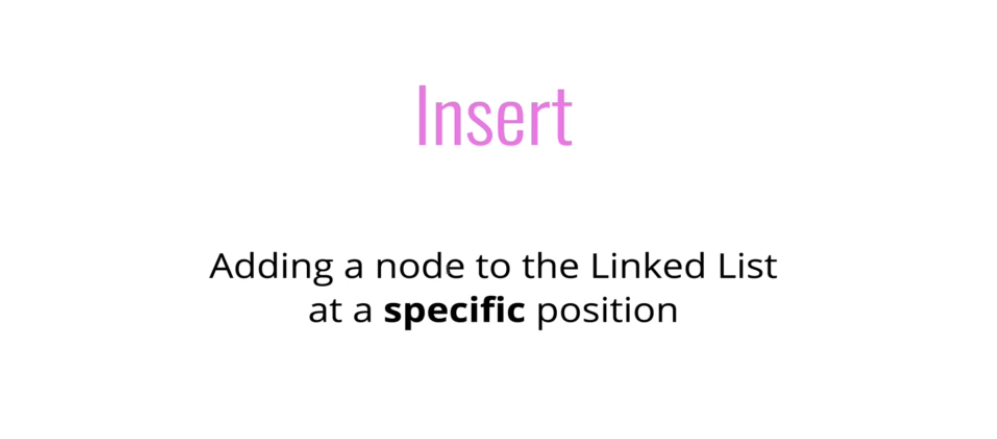
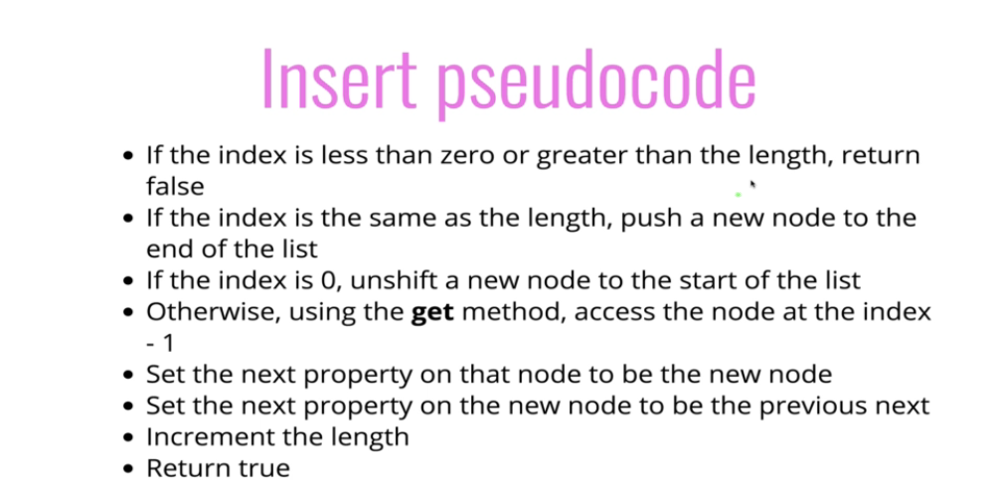

```js
 insert(index, val) {
        if (index < 0 || index > this.length) return false
        if (index === 0) return !!this.unshift(val)
        if (index === this.length) return !!this.push(val)
        let newNode = new Node(val)
        let previousNode = this.get(index - 1);
        newNode.next = previousNode.next;
        previousNode.next = newNode
        this.length += 1
        return true
    }
```

#### 8. Remove

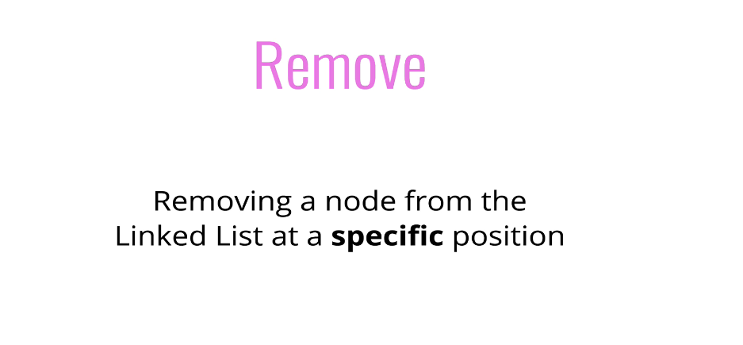
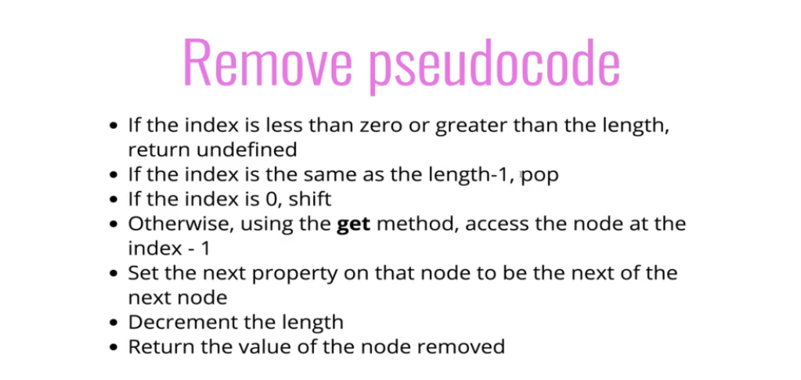

```js
 remove(index) {
        if (index < 0 || index > this.length) return undefined;
        if (index === 0) return this.shift(index);
        if (index === this.length) return this.pop();
        let previousNode = this.get(index - 1)
        let removedNode = previousNode.next
        previousNode.next = removedNode.next;
        this.length -= 1;
        return removedNode;
    }
```

#### 9 . Reverse in place

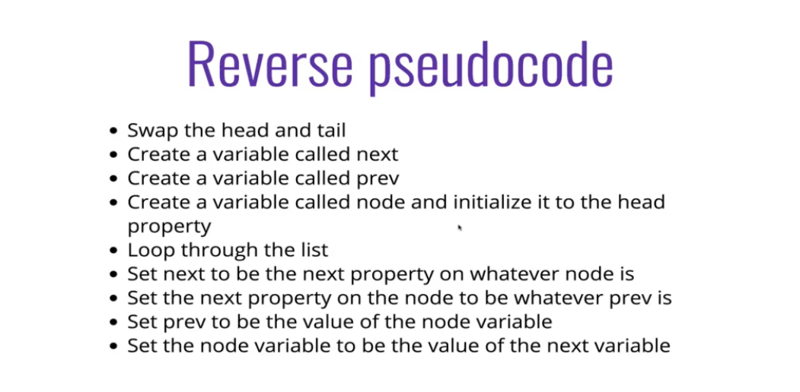

```js
 reverse() {
        let temp = this.head;
        this.head = this.tail;
        this.tail = temp;
        let next;
        let prev = null;
        for (let i = 0; i < this.length; i++) {
            next = temp.next;
            temp.next = prev;
            prev = temp;
            temp = next;
        }
    }
```

## Big O

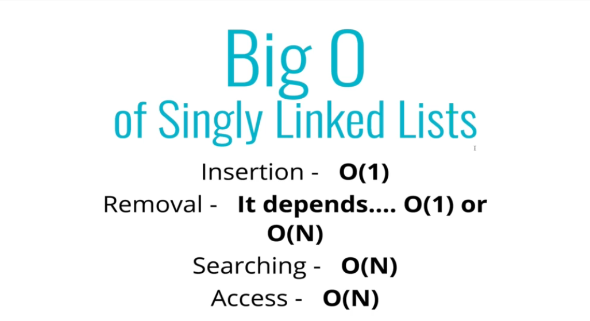

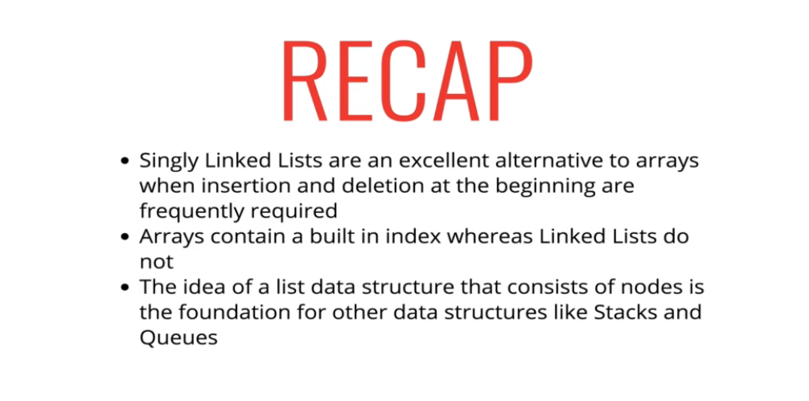
