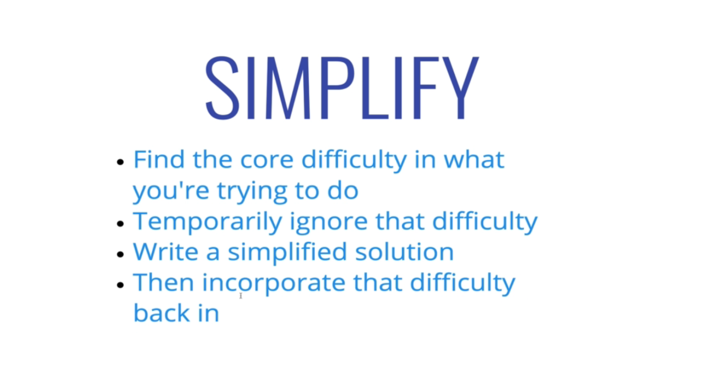
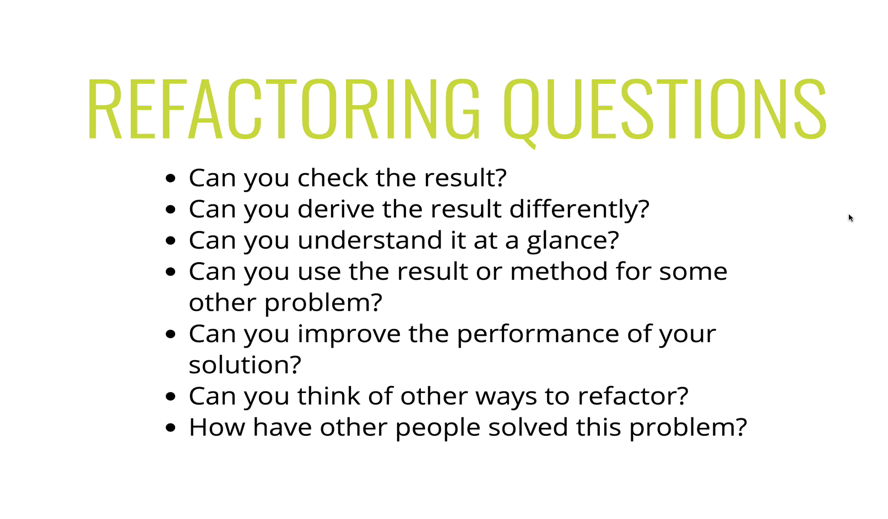

# Problem solving Approach:

#### 1. Understand the problem

#### 2. Explore concrete examples

#### 3. Break it down

#### 4. Solve / Simplify

- Solve the problem. If you can't, solve a simpler problem

#### 5. Look back and refactor

