# Recursion

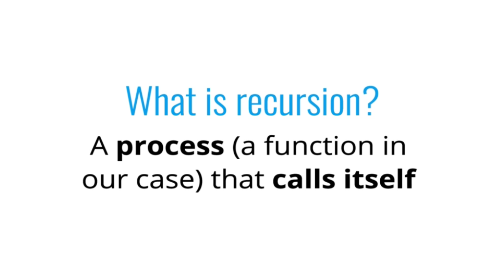
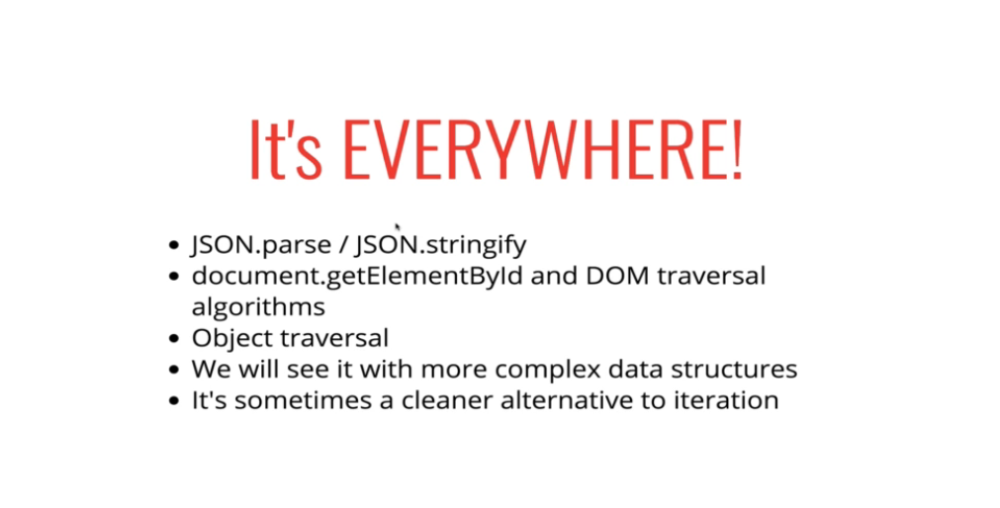

 

#### What happens when a function is called?

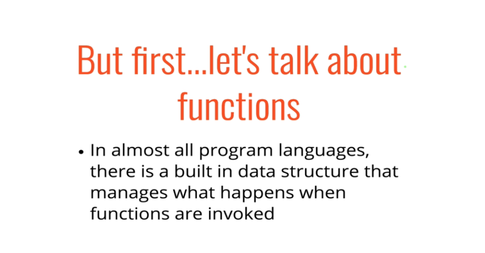
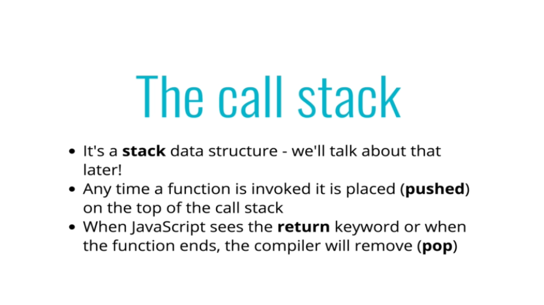
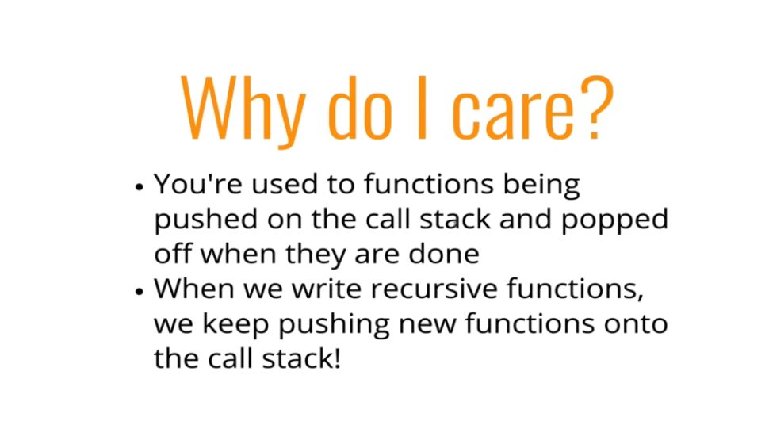
 

#### Basic Examples

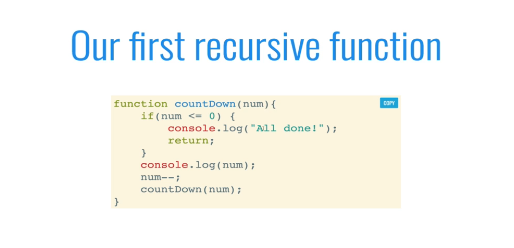

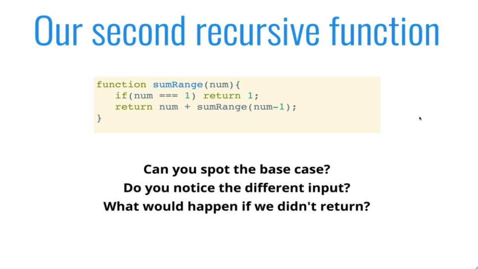
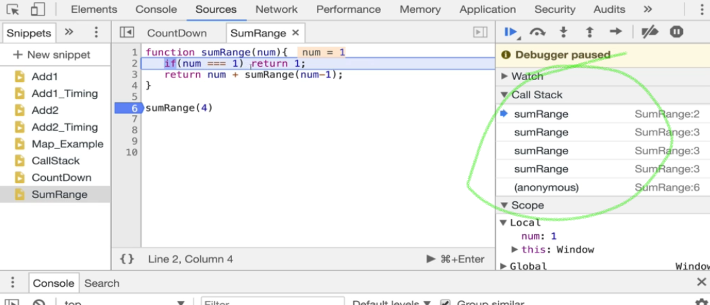
 

#### Common Mistakes

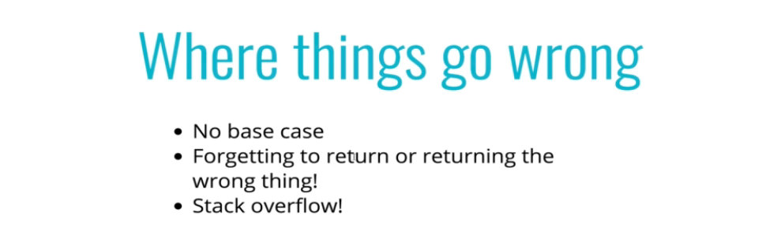

 

## Design Patterns

#### 1. Helper Method Recursion

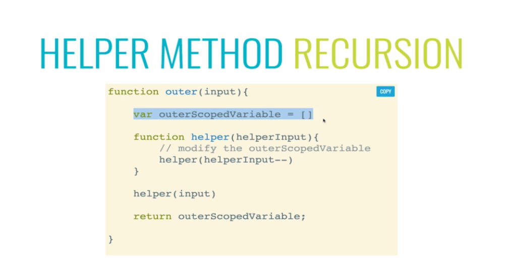

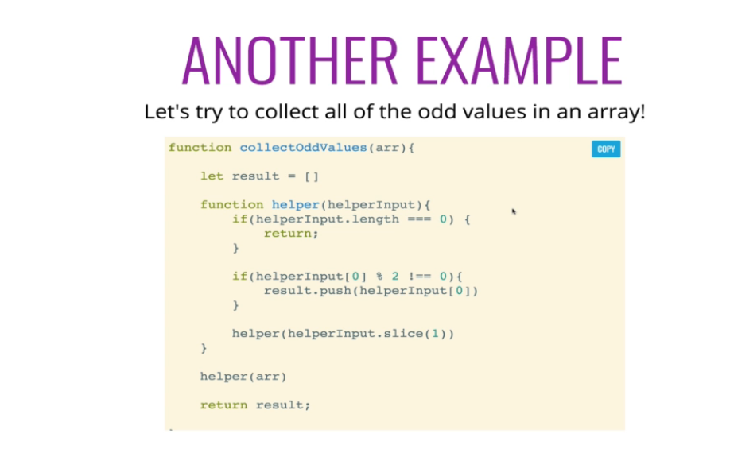
 

#### 2. Pure Recursion

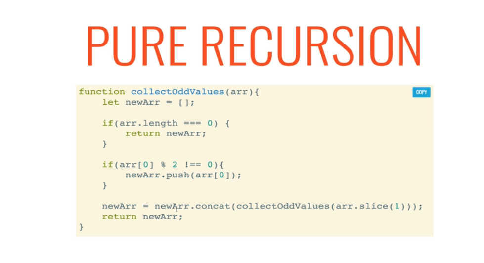
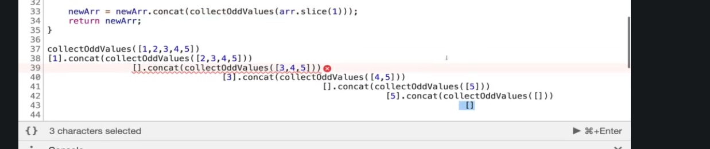

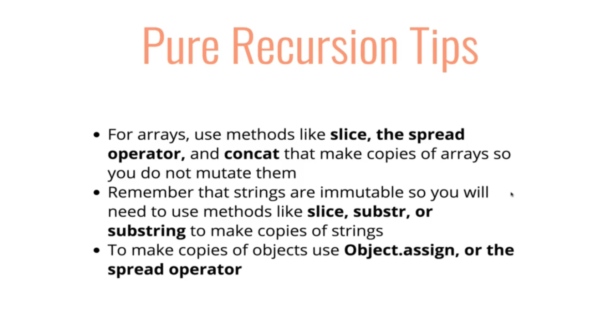

 

## Pros and cons

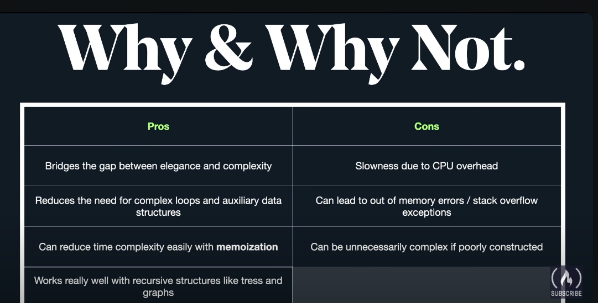
 

## How to Approach recursion :

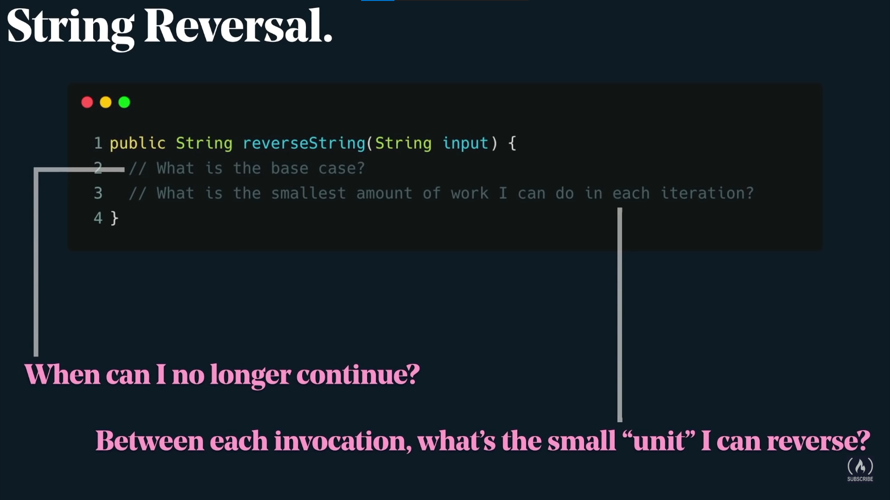

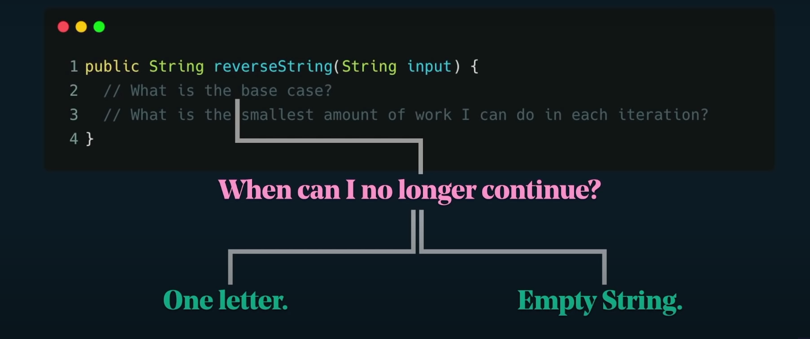

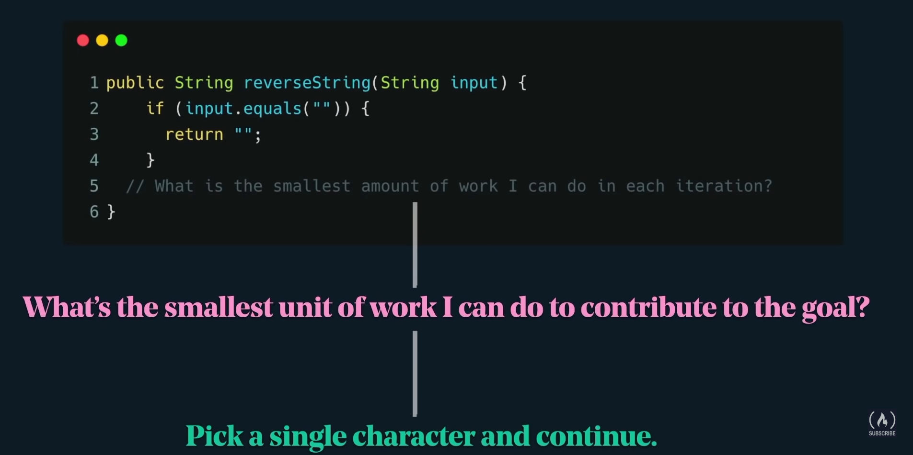

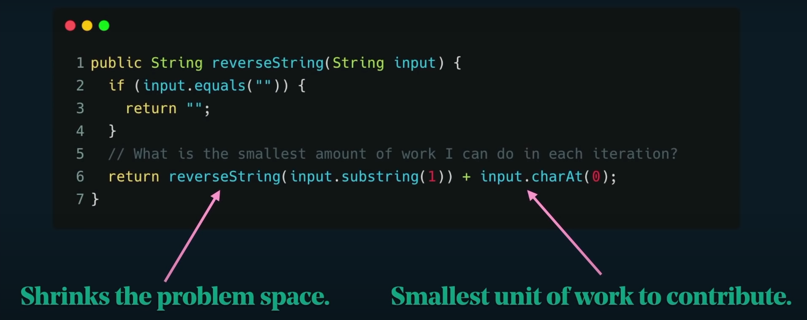

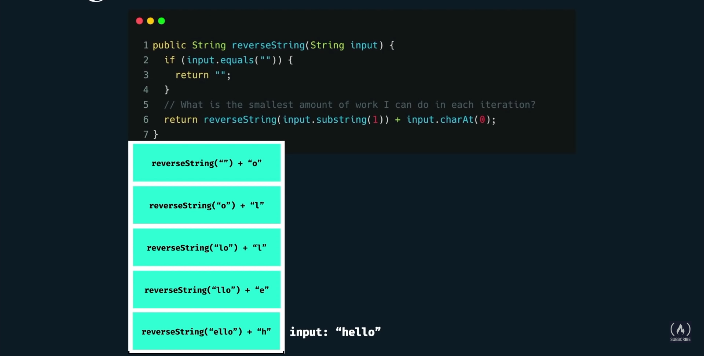
