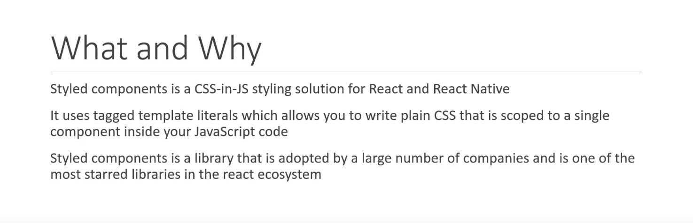
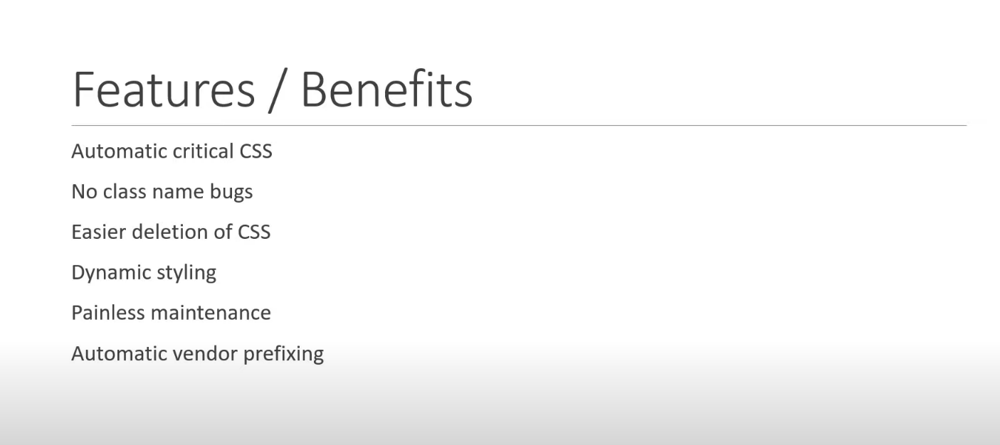
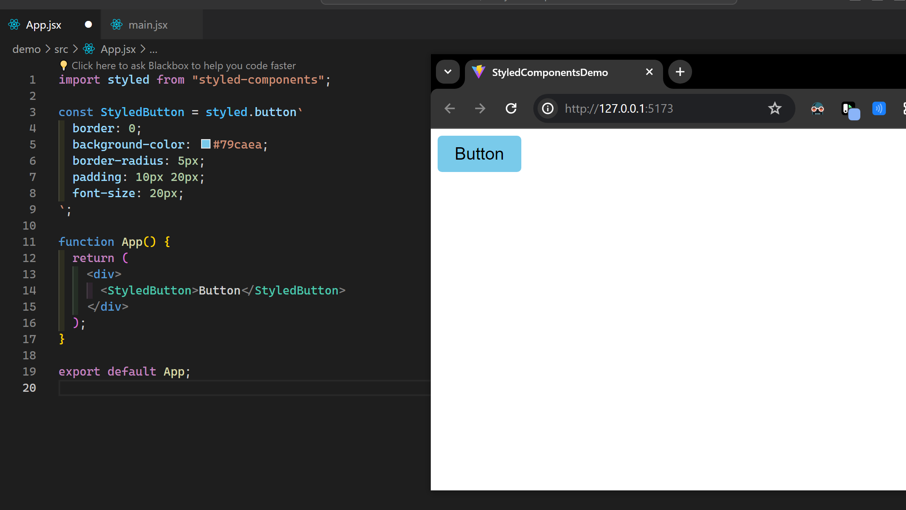
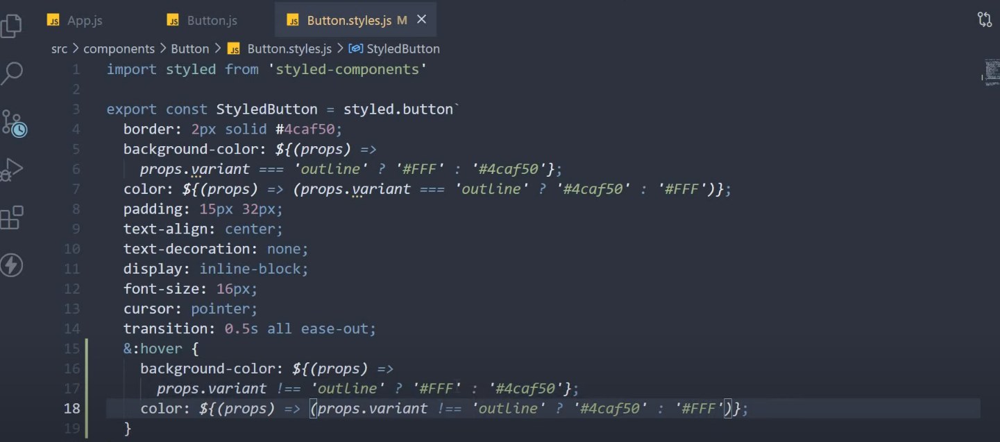
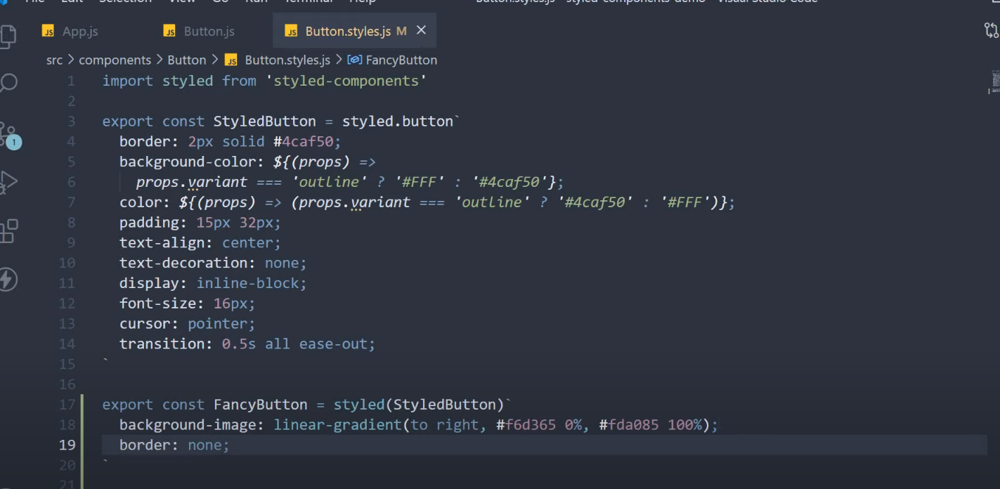
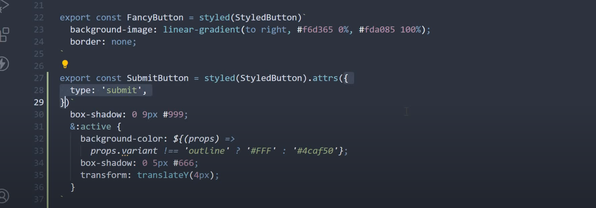
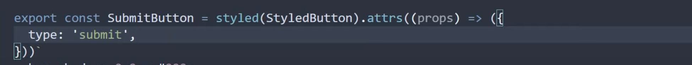
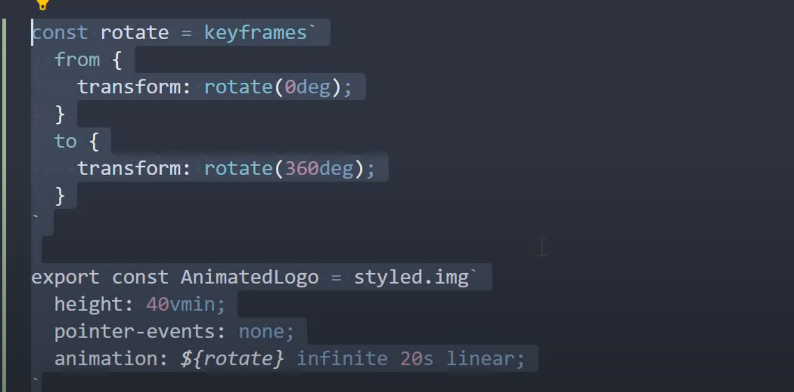
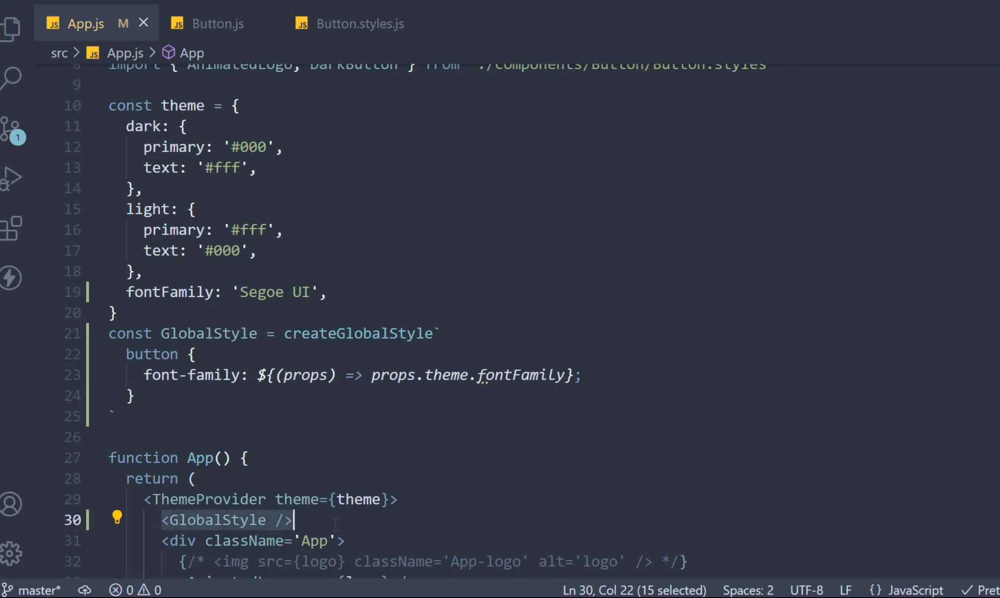

# Styled Components




<br>

### Installation

```bash
npm install styled-components
```

<br>

### Basic:



- Import `styled` from styled components;
- This object has built in method for all elements, and using `Tagged template literal` from ES6, we are passing the arguments for the method.
- Inside `` type the css styles we need to apply
- This function returns jsx with all the styles applied
  <br>

### Working with Styled components:

- Adding pesudo classes
  
  <br>
- Extending Styled components
  
  <br>
- Adding attributes to the styled components
  
  - we can also pass anonymous function which returns an object with all the congif as argument in `attrs`
    
    <br>
- Adding Animation (Import `keyframes` from styled components and pass the created keyframe variable to the animation)
  
  <br>
- We can also add `theme provider` to provide theme prop globally and `globalStyles`
  
